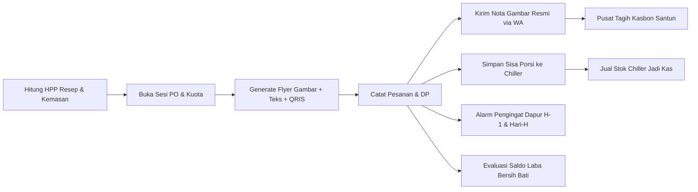

# 📘 DOKUMEN PROYEK APLIKASI: BatiKu
**"Asisten Cerdas Manajemen Operasional, Finansial, Promosi Visual & Pre-Order UMKM Kuliner"**

---

## 📑 DAFTAR ISI
1. [Ringkasan Eksekutif (Executive Summary)](#1-ringkasan-eksekutif)
2. [Latar Belakang & Realitas Pasar (Background & Market Reality)](#2-latar-belakang--realitas-pasar)
3. [Rumusan Masalah (Problem Statement)](#3-rumusan-masalah)
4. [Solusi Inovatif BatiKu (The Core Solution)](#4-solusi-inovatif-batiku)
5. [Arsitektur & Keunggulan Teknologi](#5-arsitektur--keunggulan-teknologi)
6. [Eksplorasi Fitur Unggulan Secara Rinci (Deep-Dive Features)](#6-eksplorasi-fitur-unggulan-secara-rinci)
   - [6.1 Broadcast PO Gambar + Teks Terlampir + QRIS Otomatis](#61-broadcast-po-gambar--teks-terlampir--qris-otomatis)
   - [6.2 Pengiriman Nota Gambar Digital (Digital Receipt Image Card) ke WhatsApp](#62-pengiriman-nota-gambar-digital-digital-receipt-image-card-ke-whatsapp)
   - [6.3 Tombol Simpan Berkas Gambar ke Perangkat (Local Download Storage)](#63-tombol-simpan-berkas-gambar-ke-perangkat-local-download-storage)
   - [6.4 Desain Visual Mewah (Grand Culinary Aesthetic - Anti Desain Kaku)](#64-desain-visual-mewah-grand-culinary-aesthetic---anti-desain-kaku)
   - [6.5 Halaman Penuh Kelola Stok Chiller & Freezer (Modal Beku)](#65-halaman-penuh-kelola-stok-chiller--freezer-modal-beku)
   - [6.6 Asisten Pengingat Dapur Otomatis (Local Notification Engine)](#66-asisten-pengingat-dapur-otomatis-local-notification-engine)
   - [6.7 Manajemen Piutang & Kasbon Santun](#67-manajemen-piutang--kasbon-santun)
   - [6.8 Dashboard Disiplin Saldo Laba Bersih ("Saldo Bati")](#68-dashboard-disiplin-saldo-laba-bersih-saldo-bati)
   - [6.9 Pencadangan Otomatis Google Drive Pribadi](#69-pencadangan-otomatis-google-drive-pribadi)
7. [Dampak Bisnis & Transformasi Operasional UMKM](#7-dampak-bisnis--transformasi-operasional-umkm)
8. [Rekomendasi Roadmap Pengembangan Masa Depan](#8-rekomendasi-roadmap-pengembangan-masa-depan)

---

## 1. Ringkasan Eksekutif
**BatiKu** (diambil dari filosofi bahasa Nusantara: *"Bati"* yang berarti *Keuntungan / Laba Bersih*, dan *"Ku"* yang berarti *Milik Saya*) adalah platform produktivitas dan asisten operasional dapur modern berbasis mobile (Android & iOS). Aplikasi ini dirancang khusus untuk menjembatani kesenjangan operasional pada **UMKM Kuliner Mandiri, Bisnis Pre-Order (PO), Katering Rumahan, Frozen Food / Chiller, serta Baker & Pastry**.

Mayoritas aplikasi kasir (POS) di pasaran didesain untuk transaksi langsung di meja kasir restoran (*dine-in retail*) yang menuntut koneksi internet stabil dan biaya langganan bulanan yang memberatkan. **BatiKu** hadir dengan paradigma **Kitchen-Centric, Batch-Oriented, dan Local-First**:
- **Bebas Biaya Server:** Beroperasi 100% secara lokal dan offline menggunakan basis data SQLite terenkripsi.
- **Otomasi Pemasaran & Penagihan:** Menghasilkan poster promosi visual (*marketing flyer*) dan nota belanja bergambar resmi (*digital receipt*) yang siap dikirim langsung ke WhatsApp pelanggan dalam hitungan detik.
- **Transparansi Finansial:** Memisahkan uang modal belanja bahan baku dapur dari laba riil yang aman dinikmati pemilik usaha.

---

## 2. Latar Belakang & Realitas Pasar
Bisnis kuliner rumahan bersistem **Pre-Order (PO)** dan **Frozen Food** merupakan salah satu model bisnis paling diminati karena risikonya yang rendah: penjual hanya berbelanja dan memproduksi makanan sesuai pesanan yang sudah terdata.

Namun, di lapangan terjadi fenomena ironis: **"Pesanan Ramai di WhatsApp, Tapi Keuntungan Tidak Terasa"**. Fakta di lapangan menunjukkan bahwa:
1. **Pencatatan Manual yang Melelahkan:** Penjual mencatat pesanan di secarik kertas dapur atau grup WhatsApp pribadi yang rentan terselip, salah porsi, atau basah terkena bumbu dapur.
2. **Kelemahan Teks Broadcast Biasa:** Promosi hanya berupa ketikan teks panjang yang membosankan dan sering diabaikan oleh calon pelanggan di grup WhatsApp/Instagram.
3. **Nota Pembayaran yang Tidak Profesional:** Tagihan hanya berupa teks ketikan biasa tanpa rincian resmi atau kode QRIS, membuat pelanggan sering menunda pembayaran (*kasbon*).
4. **Modal Mati di Lemari Pendingin:** Sisa makanan atau stok beku disimpan di freezer tanpa catatan modal rupiah, hingga akhirnya basi dan harus dibuang.

Pelaku usaha kuliner tidak butuh software akuntansi yang rumit. Mereka membutuhkan **asisten dapur pintar** yang dapat membuat materi promosi visual memukau, mengirim nota belanja bergambar resmi, menagih kasbon secara santun, dan mengingatkan jadwal dapur tanpa biaya sepeser pun.

---

## 3. Rumusan Masalah
Dari riset mendalam terhadap interaksi harian UMKM kuliner, dirumuskan 6 masalah pokok:

| No | Masalah Pokok (*Pain Points*) | Realitas & Konsekuensi Lapangan |
|---|---|---|
| **1** | **Promosi PO Hanya Berupa Teks Monoton** | Broadcast teks WhatsApp panjang sering di-skip pelanggan. Membuat poster gambar biasanya butuh keahlian Canva atau menyewa jasa desainer yang memakan biaya dan waktu. |
| **2** | **Nota Tagihan Manual Tanpa QRIS Terpadu** | Pelanggan memesan lalu lupa membayar karena tidak menerima nota resmi. Penjual harus mengetik ulang nomor rekening dan mengirim file barcode QRIS secara terpisah. |
| **3** | **Kasbon / Piutang Pelanggan Tercecer** | Banyak pesanan berstatus "nanti ditransfer ya" yang tidak tercatat rapi, mengakibatkan uang toko ratusan ribu hingga jutaan rupiah menguap setiap bulan. |
| **4** | **Ketidakteraturan Jadwal Dapur & Belanja** | Penjual lupa belanja bumbu H-1 atau terlambat memasak pada Hari-H pengiriman karena tidak ada alarm/pengingat jadwal otomatis. |
| **5** | **Modal Tertidur di Chiller/Freezer** | Makanan beku sisa porsi PO tidak terdata nilai HPP-nya, sehingga penjual tidak tahu berapa aset modal yang sedang mengendap di dalam kulkas. |
| **6** | **Tercampurnya Rekening Modal & Laba Usaha** | Keuntungan kotor langsung dibelanjakan untuk kebutuhan pribadi sehingga penjual kehabisan modal saat sesi PO berikutnya dibuka. |

---

## 4. Solusi Inovatif BatiKu
BatiKu menjawab seluruh persoalan di atas melalui integrasi fitur yang saling terhubung secara mulus:

1. **Mesin Desain Visual Otomatis (*Automated Graphic Engine*):** Sekali membuka sesi PO atau mencatat pesanan, poster promosi dan nota belanja bergambar langsung tercipta otomatis beresolusi tinggi (3x pixel ratio).
2. **Kirim Gambar + Teks Sekaligus ke WhatsApp:** Mengirimkan berkas poster/nota beserta teks pendukung dalam 1 klik tanpa perlu menyimpan nomor atau memotong gambar manual.
3. **Penyimpanan Lokal Mandiri (*Save to Device*):** Seluruh materi visual (poster flyer dan nota gambar) dapat disimpan langsung ke folder Download perangkat pengguna.
4. **Sistem Pengingat Mandiri (*Local Notification Assistant*):** Membunyikan notifikasi pengingat belanja dan produksi langsung di ponsel pintar tanpa ketergantungan server cloud berbayar.
5. **Manajemen Modal Beku (*Chiller Inventory*):** Memantau aset makanan beku siap jual dalam tampilan halaman penuh yang lapang dan jelas.

---

## 5. Arsitektur & Keunggulan Teknologi

### 🛠️ Spesifikasi Teknologi
- **Framework Aplikasi:** Flutter SDK (Dart) dengan arsitektur berbasis fitur (*Feature-Driven Clean Architecture*).
- **State Management:** Riverpod 2.0 StateNotifier (reaktif, *lifecycle-safe*, dan tanpa memori bocor).
- **Mesin Render Grafis:** Flutter Canvas + `RepaintBoundary` untuk menangkap tangkapan gambar beresolusi tinggi (pixelRatio: 3.0).
- **Mesin Berbagi Berkas:** `share_plus` terintegrasi dengan penanganan MIME type gambar dan teks caption terpadu.
- **Basis Data Lokal:** SQLite via `sqflite` (performa cepat, andal, tanpa latensi jaringan).
- **Mesin Notifikasi Lokal:** `flutter_local_notifications: 22.3.1` didukung oleh `timezone` dan konfigurasi Gradle Java 17 Desugaring (`desugar_jdk_libs:2.1.4`).
- **Penyimpanan Berkas:** Menggunakan *Android Scoped Storage* cascading fallback (MediaStore API + getExternalStorageDirectory).
- **Pencadangan Cloud:** Integrasi Google Drive API v3 melalui Google Sign-In & Firebase Auth dengan penjadwalan cerdas Android WorkManager.

---

## 6. Eksplorasi Fitur Unggulan Secara Rinci

### 6.1 Broadcast PO Gambar + Teks Terlampir + QRIS Otomatis
Fitur ini mengubah alur promosi PO yang tadinya lambat dan membosankan menjadi sangat cepat dan menarik:
- **Paket Berbagi Lengkap (*One-Click Rich Share*):**
  Saat tombol *"Kirim Gambar Poster ke WA"* ditekan, BatiKu tidak hanya mengirimkan gambar poster beresolusi tinggi (PNG), tetapi **sekaligus menyertakan teks caption broadcast WhatsApp terformat rapi** (berisi nama sesi, batas kuota, jadwal kirim, daftar varian menu & harga, nomor rekening, dan call-to-action pemesanan). Teks broadcast juga otomatis disalin ke *clipboard* sebagai cadangan.
- **Penyematan QRIS Toko Otomatis:**
  Jika pemilik usaha sudah mengunggah barcode QRIS toko di menu Pengaturan, gambar barcode QRIS tersebut **langsung tertanam secara otomatis di dalam poster flyer**, dilengkapi bingkai elegan dan petunjuk pembayaran.
- **Dua Tab Praktis:**
  Tersedia tab *"Poster Gambar PO"* untuk promosi visual di WhatsApp Story/Instagram, serta tab *"Teks Broadcast"* bagi penjual yang ingin menyebarkan teks kilat ke grup obrolan.

---

### 6.2 Pengiriman Nota Gambar Digital (Digital Receipt Image Card) ke WhatsApp
BatiKu menghadirkan solusi profesional untuk mengakhiri nota tulis tangan atau sekadar teks ketikan biasa:
- **Kartu Nota Digital Resmi (`DigitalInvoiceCard`):**
  Desain struk digital yang menyerupai tiket belanja premium dengan fitur:
  - **Identitas Toko Resmi:** Logo toko dalam lingkaran emas, nama toko huruf kapital, dan tagline kuliner.
  - **Data Transaksi:** Nomor unik Invoice (`#INV-...`), nama pelanggan, tanggal transaksi, dan jadwal kirim.
  - **Rincian Pesanan:** Daftar menu, kuantitas porsi, harga satuan, dan total belanja.
  - **Status Pembayaran Jelas:** Stempel cap **LUNAS** berwarna hijau zamrud untuk pesanan yang sudah beres, atau rincian **Uang Muka (DP) & Sisa Tagihan yang Belum Lunas** berwarna oranye-merah tegas.
  - **QRIS Pembayaran:** Barcode QRIS toko tampil langsung di bagian bawah nota untuk memudahkan pelanggan melunasi sisa tagihan.
  - **Doa & Ucapan Terima Kasih:** Pesan personal yang mempererat ikatan emosional dengan pelanggan.
- **Akses Cepat 1-Sentuhan:**
  Selain dapat dibuka melalui kartu pesanan, tombol **`[Lihat & Kirim Nota Gambar (Struk WA)]`** kini disematkan langsung di dalam lembar penagihan kasbon (`SendPaymentSheet`), memungkinkan penjual mengirim nota gambar resmi kapan pun tagihan disiapkan.

---

### 6.3 Tombol Simpan Berkas Gambar ke Perangkat (Local Download Storage)
BatiKu memberikan kebebasan penuh kepada pemilik usaha untuk mendokumentasikan dan mengarsipkan materi visual mereka:
- **Tombol "Simpan" pada Poster PO & Nota Gambar:**
  Tersedia tombol *"Simpan"* mandiri di samping tombol kirim WhatsApp.
- **Penyimpanan Resolusi Tinggi Tanpa Kompresi:**
  Gambar ditangkap dengan rasio piksel tinggi (3.0x) dan disimpan langsung dalam format `.png` jernih ke folder **Download / Galeri** perangkat.
- **Dukungan Penuh Android Modern (Scoped Storage):**
  Menggunakan mekanisme *multi-tier fallback* (MediaStore URI ➔ getExternalStoragePublicDirectory ➔ App External Storage) sehingga berkas tetap tersimpan sukses di Android 10, 11, 12, 13, maupun 14 tanpa risiko izin ditolak (*Permission Denied*).

---

### 6.4 Desain Visual Mewah (Grand Culinary Aesthetic - Anti Desain Kaku)
Sering kali aplikasi kasir atau pembukuan memiliki desain yang kaku seperti aplikasi perbankan lawas. BatiKu merombak total pendekatan ini:
- **Pita Emas Promo (*Grand Festive Ribbon*):**
  Banner gradien emas bertuliskan `"SPESIAL OPEN PRE-ORDER KULINER RESMI"` memberikan kesan eksklusif dan terbatas.
- **Emblem Logo Cincin Emas (*Gold-Ring Emblem*):**
  Logo toko pemilik usaha ditempatkan di tengah atas dengan bingkai cincin emas dan bayangan lembut, menaikkan kelas brand UMKM setara restoran bintang lima.
- **Palet Warna Hangat & Menggugah Selera:**
  Kombinasi warna *Deep Navy* (`#0B234F`), *Royal Gold* (`#C9A05C`), *Warm Amber* (`#D97706`), dan *Emerald Green* (`#10B981`) yang membangkitkan selera makan calon pelanggan.

---

### 6.5 Halaman Penuh Kelola Stok Chiller & Freezer (Modal Beku)
Sebelumnya fitur stok berupa *bottomsheet* geser yang sempit. Atas masukan pengguna, modul ini ditingkatkan menjadi **Halaman Layar Penuh Mandiri (`Scaffold Full Page`)**:
- **Tampilan Lega & Ergonomis:**
  Memudahkan pemeriksaan fisik lemari es saat melakukan *stock opname* di dapur.
- **Kartu Ringkasan Valuasi Modal:**
  Menampilkan **TOTAL MODAL BEKU** (dalam rupiah) dan **TOTAL PORSI** yang tersimpan di kulkas. Sisa porsi bukan lagi sekadar sisa makanan, melainkan aset likuid bernilai uang.
- **Aksi Cepat Langsung:**
  - *Jual Stok:* Menjual porsi chiller langsung ke pembeli tanpa harus membuat sesi PO baru.
  - *Update Porsi:* Menyesuaikan jumlah porsi jika terjadi susut atau penambahan manual.
  - *Peringatan Stok Rendah:* Penanda otomatis jika stok porsi tersisa ≤ 3 porsi.
  - *Floating Action Button:* Tombol `+ Tambah Stok` yang selalu melayang dan mudah dijangkau satu tangan.

---

### 6.6 Asisten Pengingat Dapur Otomatis (Local Notification Engine)
Asisten cerdas yang memastikan operasional dapur selalu tepat waktu:
- **Pemicu Notifikasi Otomatis:**
  1. **H-1 Pengiriman PO (Pukul 17:00):** Pengingat belanja bahan utama dan persiapan bumbu agar malam hari sudah siap.
  2. **Hari-H Pengiriman PO (Pukul 06:00):** Alarm persiapan masak, pengemasan (*packing*), dan koordinasi kurir pengiriman.
  3. **Peringatan Kuota Dapur (≥ 80%):** Peringatan agar penjual bersiap menutup pesanan atau menyiapkan batch tambahan.
  4. **Peringatan Kasbon:** Rekap berkala jumlah piutang yang belum tertagih.
- **Pusat Notifikasi Interaktif di Dashboard:**
  Ikon lonceng di Dashboard memiliki titik merah (*unread badge*) yang reaktif. Saat ditekan, membuka panel dengan filter kategori (*Jadwal PO, Kasbon & Tagihan, Dapur & Cadangan*) serta tombol aksi langsung ke layar terkait.
- **100% Offline & Hemat Baterai:**
  Menggunakan `AndroidNotificationChannel` lokal tanpa koneksi internet dan tanpa biaya server FCM.

---

### 6.7 Manajemen Piutang & Kasbon Santun
- **Katalog Piutang:** Memisahkan pesanan lunas, pesanan dengan uang muka (DP), dan pesanan belum bayar sama sekali.
- **Generator Teks Tagihan Ramah:** Menyusun pesan WhatsApp penagihan yang santun, personal, dan tidak canggung, lengkap dengan rincian sisa nominal dan pilihan rekening transfer.
- **Pelunasan Bertahap:** Catat penerimaan cicilan atau DP secara bertahap hingga pesanan lunas.

---

### 6.8 Dashboard Disiplin Saldo Laba Bersih ("Saldo Bati")
- **Pemisahan Finansial Riil:** Menghitung Omzet kotor, modal bahan (HPP), dan beban kemasan secara otomatis untuk menghasilkan angka **Laba Bersih Riil (Saldo Bati)**.
- **Kartu Edukasi Kas:** Mencegah pemilik usaha mengambil uang modal untuk konsumsi pribadi dengan menampilkan persentase alokasi yang aman ditarik sebagai gaji (*owner's draw*).
- **Evaluasi Batch Terakhir:** Membandingkan rencana laba dengan laba nyata setelah sesi PO ditutup.

---

### 6.9 Pencadangan Otomatis Google Drive Pribadi
- **Penyimpanan Terisolasi & Pribadi:** Berkas basis data dicadangkan langsung ke folder Google Drive pribadi milik akun Google pengguna, bukan ke server pihak ketiga.
- **Penjadwalan Otomatis WorkManager:** Sinkronisasi cerdas berjalan di latar belakang saat ponsel terhubung ke Wi-Fi dan sedang diisi daya.
- **Ekspor/Impor Berkas Cadangan:** Pengguna dapat mengekspor berkas `.db` fisik secara mandiri ke memori ponsel untuk migrasi perangkat tanpa internet.

---

## 7. Dampak Bisnis & Transformasi Operasional UMKM

| Parameter Operasional | Metode Konvensional (Buku & Chat WA) | Menggunakan Aplikasi BatiKu |
|---|---|---|
| **Waktu Pembuatan Materi Promosi** | 45-60 menit (mengetik teks panjang atau mendesain poster manual di Canva). | **10 Detik:** Poster visual ber-QRIS dan teks broadcast tercipta otomatis bersamaan. |
| **Penyampaian Nota ke Pelanggan** | Hanya teks ketikan biasa; rawan diabaikan pembeli dan sering timbul sengketa salah hitung. | **Gambar Nota Resmi:** Tampil profesional, memuat logo toko, rincian menu, stempel lunas, dan QRIS. |
| **Koleksi Piutang / Kasbon** | Piutang sering lupa ditagih; potensi rugi ratusan ribu hingga jutaan rupiah per bulan. | **Terkontrol 100%:** Seluruh pesanan belum lunas terpantau dan dapat ditagih ramah dalam 1 klik. |
| **Manajemen Sisa Makanan** | Sisa makanan di freezer terlupakan hingga basi dan terbuang (*food waste*). | **Tercatat sebagai Modal Beku:** Terpantau dalam rupiah di modul Chiller dan siap dijual kembali. |
| **Disiplin Arus Kas (Cashflow)** | Uang modal belanja dan uang makan pribadi tercampur dalam satu kantong. | **Saldo Bati Terpisah:** Penjual tahu pasti berapa hak laba yang aman dinikmati tanpa mengorbankan modal. |
| **Ketergantungan Biaya Langganan** | Aplikasi POS online mengenakan biaya Rp100.000 - Rp300.000 per bulan. | **Rp 0 (Gratis Selamanya):** Bekerja 100% lokal tanpa biaya server dan tanpa ketergantungan internet. |

---

## 8. Rekomendasi Roadmap Pengembangan Masa Depan

1. **Integrasi Thermal Bluetooth Printer (58mm / 80mm):**
   - Mendukung pencetakan fisik nota digital atau stiker label kemasan (*packaging sticker label*) untuk ditempelkan langsung pada box makanan/lunchbox.
2. **Katalog Web Mini (Online Order Bio-Link):**
   - Tautan web sederhana yang dapat dipasang di bio Instagram/TikTok toko, di mana pelanggan dapat memilih menu dan pesanan langsung terformat menjadi pesan WhatsApp ke penjual.
3. **Kalkulator Nutrisi & Perkiraan Masa Simpan P-IRT:**
   - Estimasi kalori, kandungan gizi, dan masa simpan bahan untuk mendukung izin edar P-IRT dan sertifikasi halal UMKM.
4. **Ekspor Laporan PDF/Excel Siap Bank:**
   - Laporan keuangan laba-rugi periodik terstandarisasi yang siap dicetak untuk pengajuan pinjaman modal usaha (KUR) ke perbankan.
